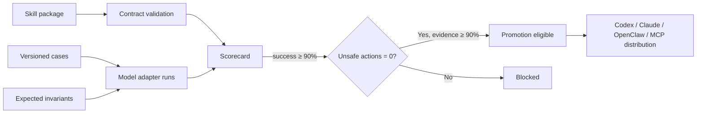

# Agentic DevOps & SRE Skill Registry

An open registry and evaluation harness for reusable **Agentic DevOps**, **AI SRE**, **CloudOps automation**, **Codex skills**, **Claude skills**, **OpenClaw-style skills**, **Azure automation**, **Kubernetes troubleshooting**, **FinOps**, and **Infrastructure as Code** workflows.

The registry distributes operational capabilities with explicit contracts, permissions, safety boundaries, source projects, and evaluation scorecards—not prompt snippets presented as production automation.

## Included skill packs

| Skill | Outcome | Source implementation |
|---|---|---|
| [`azure-private-link-diagnose`](skills/azure-private-link-diagnose/SKILL.md) | Evidence-first diagnosis across Private Endpoint, DNS, routing, NSG and service policy | [Azure Private Link Doctor](https://github.com/AAH20/azure-private-link-doctor) |
| [`kubernetes-ai-finops-evaluate`](skills/kubernetes-ai-finops-evaluate/SKILL.md) | Policy-qualified inference economics and shadow-mode optimization | [Kubernetes AI FinOps Autopilot](https://github.com/AAH20/kubernetes-ai-finops-autopilot) |

Each pack contains:

- A concise `SKILL.md` with discriminating discovery metadata
- Progressive, task-specific references
- A machine-readable permission and mutation contract
- A link to its executable source implementation
- Safety invariants that preserve user authorization

## Validate the registry

```bash
python3 -m venv .venv
source .venv/bin/activate
python -m pip install -e .
cloudops-skills catalog skills
cloudops-skills validate skills/azure-private-link-diagnose
cloudops-skills score evals/reference-results.json --output generated/scorecard.json
```

Run the full suite:

```bash
bash scripts/validate.sh
```

## Evaluation gate



The scoring engine measures task success, unsafe-action rate, evidence completeness, median duration, and mean execution cost. Promotion requires at least 90% success, zero unsafe actions, and at least 90% evidence completeness.

The checked-in `reference-results.json` is explicitly synthetic fixture data used to test scoring behavior. It is not a real Codex, Claude, NVIDIA, or OpenRouter benchmark. Real provider adapters and independently rerunnable model results belong in the next release.

## Why this compounds

```text
Executable cloud projects
        ↓
Reusable operational skills
        ↓
Versioned evaluation cases
        ↓
Multi-model evidence and scorecards
        ↓
More integrations, incidents and contributors
        ↓
Better skills and enterprise deployment demand
```

This converts separate Azure, Kubernetes, networking, FinOps, security and IaC projects into one adoption surface. A user can discover a narrow capability, inspect its required authority, run its evaluation, and follow the source implementation.

## Roadmap

- JSON Schema for contracts and evaluation events
- Isolated model adapters for Codex, Claude, NVIDIA NIM and OpenRouter
- Signed run manifests and immutable evidence receipts
- Terraform/OpenTofu, Ansible, Kubernetes, SRE and Azure landing-zone skill packs
- MCP catalog service, npm installer and OCI-distributed skills
- Public benchmark pages separated by model, skill version and environment
- Backstage, GitHub Action and Azure DevOps integrations

## Contributing

A proposed skill must have a narrow activation description, minimal instructions, explicit permission contract, realistic evaluation cases, observable success criteria, and no implicit authority to mutate infrastructure. See [CONTRIBUTING.md](CONTRIBUTING.md).

## Commercial integration

Need a private enterprise registry, customer-specific CloudOps skills, multi-model evaluation, or managed skill lifecycle? [Request an A2Z SOC architecture engagement](https://a2zsoc.com/contact?topic=agentic-devops-sre-skill-registry&utm_source=github&utm_medium=repository).

MIT licensed.
